# Speed Control of a DC Motor using Arduino PWM Technique with IGBT Chopper Circuit

> **Diploma Final Year Group Project** — M. H. Saboo Siddik Polytechnic (Aided), Mumbai  
> **Academic Year:** 2017–2018  
> **Department:** Electrical Engineering  
> **Board:** Maharashtra State Board of Technical Education (MSBTE)

---

## 👥 Team Members

| Name | Roll No. |
|------|----------|
| Simran Correia | 15206 |
| Jadhav Sanket Suresh | 15210 |
| Joshi Umesh Yadneshwar | 15213 |
| Khan Ashfaque Hamid Hussain | 15216 |

**Project Guide:** Prof. (Mrs.) Kalaivani Muthuvelan & Mr. Arjun Lad  
**Industry Partner:** Silicon Control System, Dombivali  
**Project Period:** January 2018 – March 2018

---

## 📌 Project Overview

This project demonstrates the **speed control of a DC motor** using:
- **Arduino UNO** as the microcontroller / PWM signal generator
- **IGBT (Insulated Gate Bipolar Transistor)** as the switching device in a DC chopper circuit
- **PWM (Pulse Width Modulation)** technique to regulate motor voltage from 0V to 230V

The system allows smooth, reliable speed control from 0 RPM to the motor's rated speed of 2000 RPM. Two control modes were implemented: a **potentiometer-based** analog control and a **keypad-based** digital input control.

---

## ⚙️ How It Works

```
[Potentiometer / Keypad Input]
          |
          v
    [Arduino UNO]  ──── generates PWM signal
          |
          v
  [Gate Drive Circuit]  ──── isolates & amplifies PWM (optocoupler IC)
          |
          v
      [IGBT Switch]  ──── chops 230V DC supply
          |
          v
   [DC Motor Load]  ──── speed varies with duty cycle
          |
          v
  [LCD Display]  ──── shows duty cycle % and voltage in real-time
```

**Key principle:** The duty cycle of the PWM signal directly controls the average voltage supplied to the motor, thereby controlling its speed. At 50% duty cycle → ~115V → ~1000 RPM.

---

## 🔧 Components Used

| Component | Quantity | Cost (INR) |
|-----------|----------|------------|
| IGBT | 1 | ₹1500 |
| Arduino UNO | 1 | ₹400 |
| Inductor | 1 | ₹1500 |
| Capacitor | 1 | ₹1300 |
| Heat Sink | 1 | ₹800 |
| Multimeter | 1 | ₹800 |
| Motor Driver Components | (set) | ₹500 |
| Ammeter & Voltmeter | 1 each | ₹400 |
| Push Buttons | 2 | ₹75 |
| LCD Display (20x4) | 1 | ₹300 |
| Potentiometer | 1 | ₹10 |
| Terminals (+ve / -ve sets) | 3 sets | ₹90 |
| Panel Fabrication & Colouring | — | ₹1500 |
| Miscellaneous Components | — | ₹1000 |
| **Total** | | **₹9,500** |

---

## 💻 Arduino Code

Two control modes were programmed:

### 1. Potentiometer Control (`potentiometer_control.ino`)
- Reads analog input from a potentiometer
- Maps the value to a PWM duty cycle (0–255)
- Displays duty cycle % and equivalent voltage on the LCD
- Includes **soft start** (ramps up over 20 seconds) and **smooth stop** features

### 2. Keypad Control (`keypad_control.ino`)
- User enters desired speed percentage (0–100%) via a 4x3 keypad
- Maps the entered value to PWM and drives the motor accordingly
- LCD shows the entered speed and confirmation

See the [`/code`](./code/) folder for full source code.

---

## 📊 Results

The system was tested in the industry lab at Silicon Control System, Dombivali. PWM waveforms were captured using an oscilloscope at various duty cycles.

### PWM Waveforms (Simulation & Experimental)

| Waveform 1 | Waveform 2 |
|:---:|:---:|
| 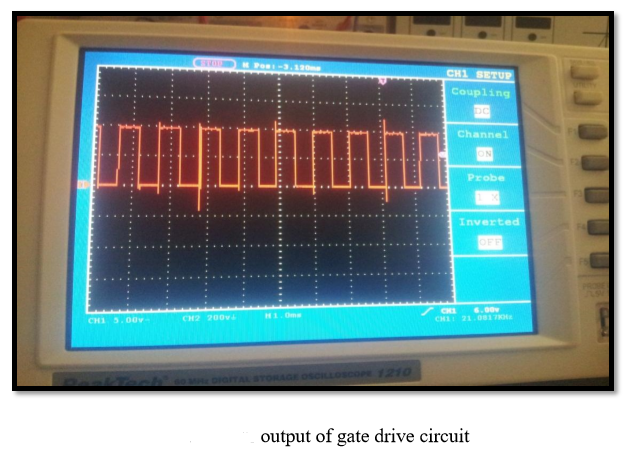 | 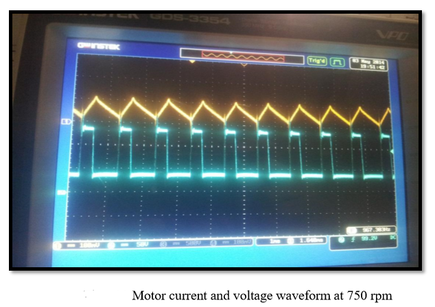 |

| Waveform 3 | Waveform 4 |
|:---:|:---:|
| 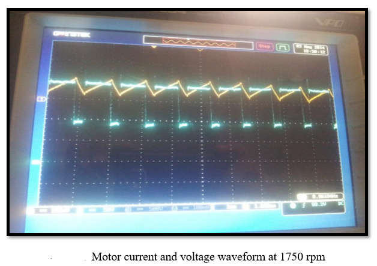 | 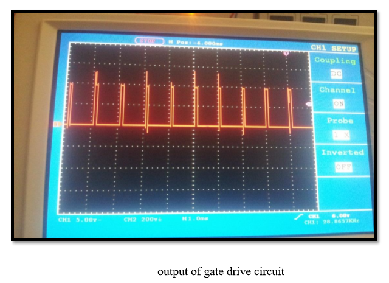 |

| Waveform 5 | Waveform 6 |
|:---:|:---:|
| 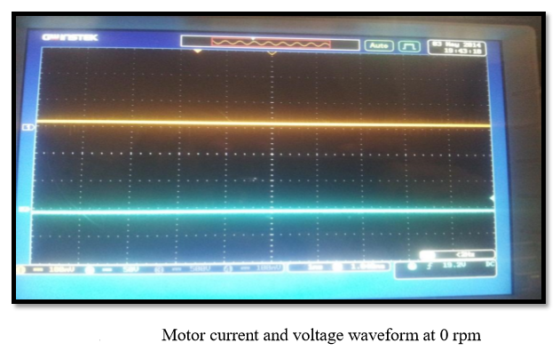 | 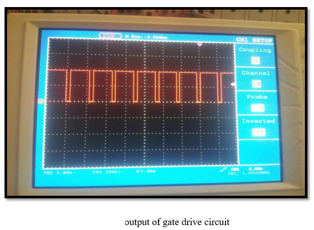 |

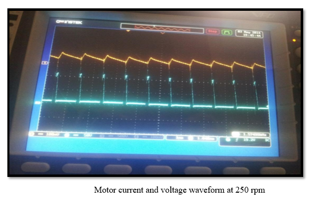

**Key observations:**
- At **low duty cycle** → low motor speed, low average voltage
- At **high duty cycle** → high motor speed, voltage approaching 230V
- Speed varied **smoothly and proportionally** with the duty cycle
- No speed variation observed under varying load (within rated range)

### Circuit & Hardware

| Block Diagram | Circuit Diagram |
|:---:|:---:|
| 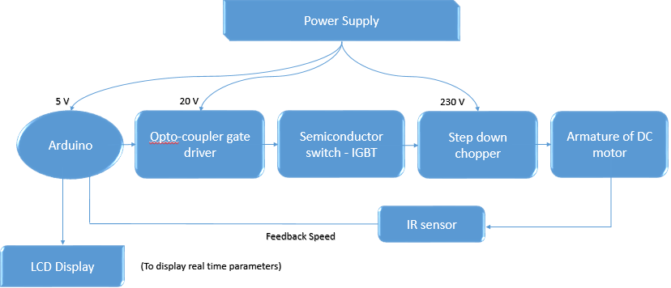 | 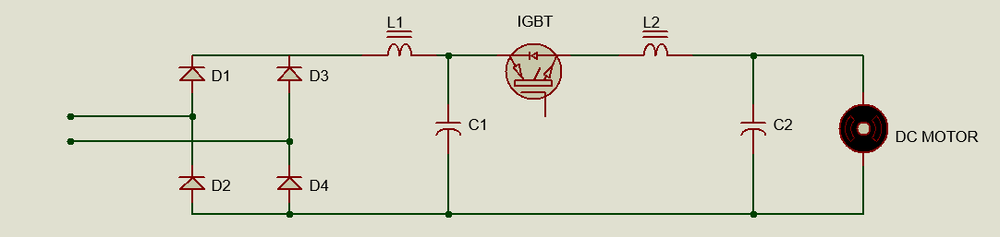 |

### Hardware Setup

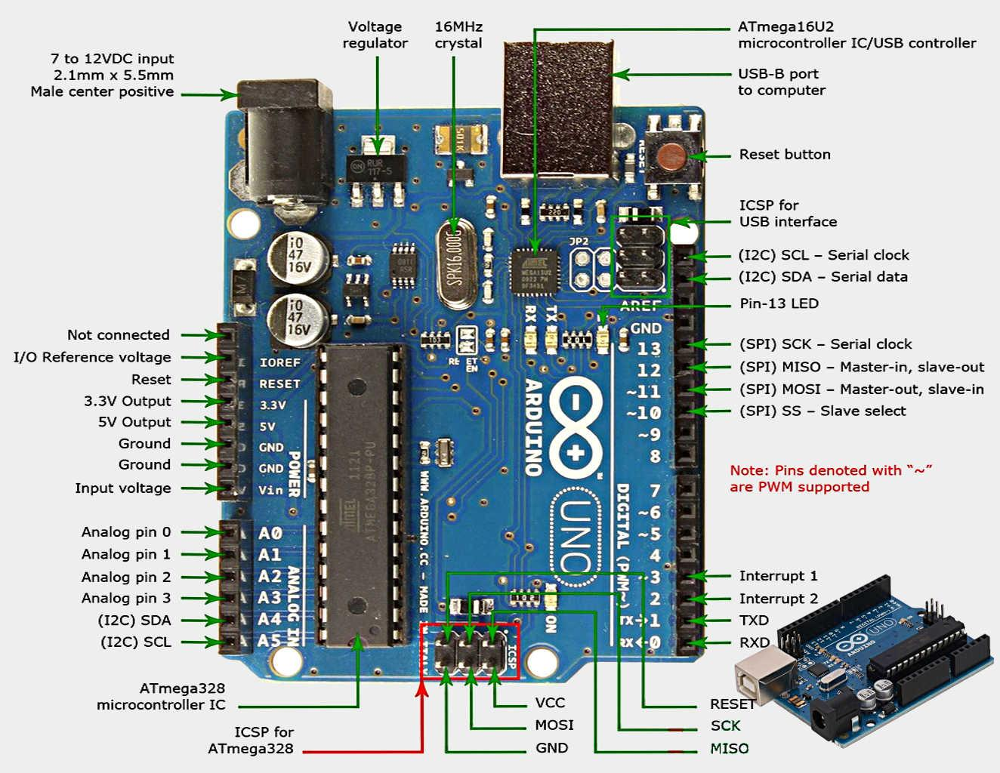

| Hardware Photo 2 | Hardware Photo 3 |
|:---:|:---:|
 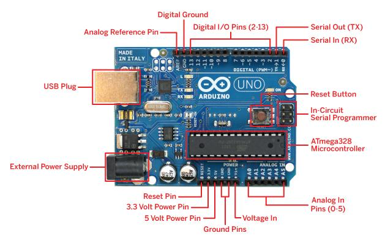 

---

## 🔬 Technical Concepts

- **DC Chopper:** Converts fixed DC to variable DC using a fast-switching device (IGBT)
- **PWM:** Controls the on/off time ratio of the IGBT switch to vary average output voltage
- **IGBT Gate Drive:** Optocoupler-based circuit that isolates and amplifies Arduino's 5V PWM signal to drive the IGBT gate
- **Soft Start / Smooth Stop:** Gradual ramp-up and ramp-down to protect motor from sudden surges

---

## 📁 Repository Structure

```
dc-motor-speed-control/
│
├── README.md                          ← Project overview (this page)
├── Final_Year_Project_Report.docx     ← Full project report
│
├── code/
│   ├── potentiometer_control.ino      ← Arduino code: potentiometer mode
│   └── keypad_control.ino             ← Arduino code: keypad mode
│
├── circuit/
│   └── circuit_description.md         ← Circuit explanation & pin connections
│
├── results/
│   └── results_summary.md             ← Observations and analysis
│
└── images/
    ├── results/                        ← PWM waveform captures (7 images)
    ├── circuit/                        ← Block diagram, circuit diagrams
    └── hardware/                       ← Hardware setup photos
```

---

## 📚 References

1. Muhammad H. Rashid — *Power Electronics Circuits, Devices and Applications*, 3rd Ed., Prentice Hall, 2004
2. L. Boaz — *Microcontroller Based Industrial DC Motors Console Model Simulation in PROTEUS ISIS*, 2014
3. P. C. Sen & M. L. MacDonald — *Chopper based DC Drives with Regenerative Braking and Speed Reversal*, IEEE, 1978
4. Abu Zaharin Ahmad & Mohd Nasir Taib — *A Study on DC Motor Speed Control by Using Back-EMF Voltage*, AsiaSENSE, 2003
5. Lawrence A. Duarte — *The Microcontroller Beginner's Handbook*, 2nd Ed., Prompt Publication, 1998
6. [arduino.cc/reference](https://www.arduino.cc/reference)

---

## 🏫 Institution

**M. H. Saboo Siddik Polytechnic (Aided)**  
8, Saboo Siddik Polytechnic Road, Byculla, Mumbai – 400 008  
Affiliated to: Maharashtra State Board of Technical Education (MSBTE)

---

*This project was completed as part of the Diploma in Electrical Engineering curriculum (Sixth Semester) during the academic year 2017–18.*
