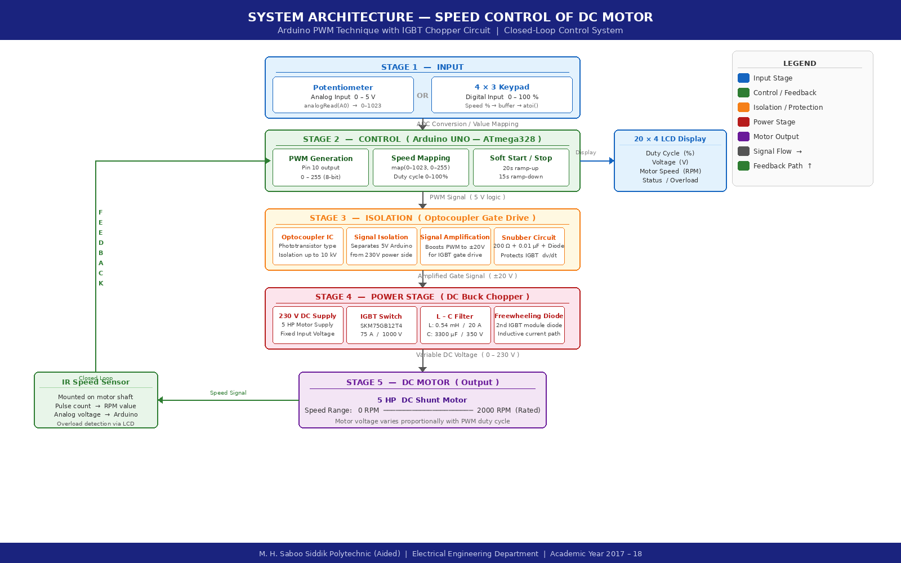

<div align="center">

# ⚡ Speed Control of DC Motor
## Using Arduino PWM Technique with IGBT Chopper Circuit


<br>

> **Diploma Final Year Project** — Electrical Engineering Department  
> M. H. Saboo Siddik Polytechnic (Aided), Byculla, Mumbai  
> Maharashtra State Board of Technical Education (MSBTE)

</div>

---

## 👥 Team Members

<div align="center">

| &nbsp;&nbsp;&nbsp;&nbsp;&nbsp;&nbsp;&nbsp;&nbsp; Name &nbsp;&nbsp;&nbsp;&nbsp;&nbsp;&nbsp;&nbsp;&nbsp; | Roll No. |
|:---:|:---:|
| Simran Correia | 15206 |
| Jadhav Sanket Suresh | 15210 |
| Joshi Umesh Yadneshwar | 15213 |
| Khan Ashfaque Hamid Hussain | 15216 |

</div>

<div align="center">

**Project Guide:** Prof. (Mrs.) Kalaivani Muthuvelan &nbsp;&&nbsp; Mr. Arjun Lad  
**Industry Partner:** Silicon Control System, Dombivali &nbsp;|&nbsp; **Period:** Nov. 2017 – Mar. 2018

</div>

---

## 📌 Abstract

This project presents the design and implementation of a **DC motor speed control system** using **Pulse Width Modulation (PWM)** generated by an **Arduino UNO** microcontroller, driving an **IGBT-based DC chopper circuit**. The system regulates motor voltage continuously from **0V to 230V**, enabling smooth speed variation from **0 RPM to 2000 RPM** under varying load conditions.

Two user interfaces were implemented, a **potentiometer** for analog control and a **4×3 keypad** for digital speed input with real-time feedback on a **20×4 LCD display**. The project was simulated in **Proteus ISIS** and physically implemented at an industrial facility, demonstrating a practical, low-cost solution for industrial DC motor control.

---

## 🔁 System Architecture

<div align="center">



</div>

---

## ⚙️ Working Principle

The motor speed is controlled by varying the **average DC voltage** using PWM:

$$\text{Average Voltage} = \text{Duty Cycle} \times \text{Supply Voltage} = \frac{t_{ON}}{T} \times 230\text{V}$$

<div align="center">

| Duty Cycle | Average Voltage | Motor Speed |
|:----------:|:---------------:|:-----------:|
| 0% | 0 V | 0 RPM |
| 25% | 57.5 V | ~500 RPM |
| 50% | 115 V | ~1000 RPM |
| 75% | 172.5 V | ~1500 RPM |
| 100% | 230 V | ~2000 RPM |

</div>

---

## 💻 Arduino Code — Control Modes

### Mode 1 — Potentiometer Control
```
Potentiometer ──► analogRead(A0) ──► map(0–1023 → 0–255) ──► analogWrite(PWM pin)
```
- **Soft Start:** Motor ramps from 0 to speed gradually over **20 seconds**
- **Smooth Stop:** On button press, motor decelerates over **15 seconds**
- LCD shows real-time duty cycle (%) and equivalent voltage (V)

### Mode 2 — Keypad Control
```
Keypad Entry (0–100%) ──► atoi() ──► map(0–100 → 0–255) ──► analogWrite(PWM pin)
```
- User types desired speed % on 4×3 keypad
- LCD confirms input before driving the motor

> 📂 Full source code available in the [`/code`](./code/) folder

---

## 📊 Results & Waveforms

All waveforms were captured on an oscilloscope during hardware testing at Silicon Control System, Dombivali. Circuit behaviour was first verified through **Proteus ISIS** simulation.

### PWM Waveforms at Various Duty Cycles

<div align="center">

| | |
|:---:|:---:|
|  |  |
|  |  |
|  |  |


</div>

**Key Observations:**
- Motor speed increased **smoothly and proportionally** with duty cycle — validating PWM control theory
- Speed remained **stable under varying load** conditions within rated capacity
- Soft start and smooth stop functioned correctly, eliminating inrush current surges
- No oscillation or instability observed across the full 0–2000 RPM range

---

## 🔌 Circuit & Hardware

### Circuit Diagrams

<div align="center">

| Block Diagram | Circuit Diagram |
|:---:|:---:|
|  |  |

</div>

### Hardware Implementation

<div align="center">


*Arduino Uno Board Pin Configuration*

<br><br>


*Control panel close-up*

</div>

---

## 🔬 Key Technical Concepts

<div align="center">

| Concept | Description |
|:--------|:------------|
| **DC Chopper** | Converts fixed DC to variable DC by rapidly switching IGBT ON/OFF |
| **PWM** | Controls average output voltage by varying the ON-time ratio of the switch |
| **IGBT** | High-power switching device capable of handling the full 230V DC motor load |
| **Gate Drive** | Optocoupler circuit that isolates and amplifies Arduino PWM to trigger IGBT |
| **Soft Start** | Gradual ramp-up over 20s to prevent inrush current damage to the motor |
| **Smooth Stop** | Gradual deceleration over 15s to prevent mechanical shock on motor shaft |
| **Freewheeling Diode** | Provides inductive current path during IGBT OFF period, prevents voltage spikes |

</div>

---

## 📁 Repository Structure

```
Speed_Control_of_DC_Motor/
│
├── README.md                          ← Project overview (this page)
├── Final_Year_Project_Report.docx     ← Complete project report
│
├── code/
│   ├── potentiometer_control.ino      ← Arduino: analog potentiometer mode
│   └── keypad_control.ino             ← Arduino: digital keypad mode
│
├── circuit/
│   └── circuit_description.md         ← Detailed circuit & pin connections
│
├── results/
│   └── results_summary.md             ← Observations & analysis
│
└── images/
    ├── results/     ← Oscilloscope waveform captures (7 images)
    ├── circuit/     ← Block diagram, circuit diagrams
    └── hardware/    ← Hardware setup & panel photos
```

---

## 📚 References

1. Muhammad H. Rashid — *Power Electronics Circuits, Devices and Applications*, 3rd Ed., Prentice Hall, 2004
2. L. Boaz — *Microcontroller Based Industrial DC Motors Console Model Simulation in PROTEUS ISIS*, 2014
3. L. Boaz & S. Priyatharshini — *Atmega 328 Based Industrial Conveyor Model Simulation in PROTEUS ISIS*, IJSRD, 2015
4. P. C. Sen & M. L. MacDonald — *Chopper based DC Drives with Regenerative Braking and Speed Reversal*, IEEE Transactions on Energy Conversion, 1978
5. Abu Zaharin Ahmad & Mohd Nasir Taib — *A Study on DC Motor Speed Control by Using Back-EMF Voltage*, AsiaSENSE, 2003
6. Lawrence A. Duarte — *The Microcontroller Beginner's Handbook*, 2nd Ed., Prompt Publication, 1998
7. [Arduino Official Reference — arduino.cc/reference](https://www.arduino.cc/reference)

---

## 💰 Project Cost Analysis

<div align="center">

| Sr. No. | Component | Cost (INR) |
|:-------:|:----------|:----------:|
| 1 | IGBT | ₹1,500 |
| 2 | Arduino UNO | ₹400 |
| 3 | Inductor | ₹1,500 |
| 4 | Capacitor | ₹1,300 |
| 5 | Heat Sink | ₹800 |
| 6 | Multimeter | ₹800 |
| 7 | Motor Driver Components | ₹500 |
| 8 | Ammeter & Voltmeter | ₹400 |
| 9 | Push Buttons (×2) | ₹75 |
| 10 | LCD Display (20×4) | ₹300 |
| 11 | Potentiometer | ₹10 |
| 12 | Terminal Sets (×3) | ₹90 |
| 13 | Panel Fabrication & Colouring | ₹1,500 |
| 14 | Miscellaneous Components | ₹1,000 |
| | **Total Project Cost** | **₹9,500** |

</div>

---

## 🏫 Institution

<div align="center">

**Anjuman-I-Islam's M. H. Saboo Siddik Polytechnic (Aided)**  
8, Saboo Siddik Polytechnic Road, Byculla, Mumbai – 400 008  
Affiliated to: **Maharashtra State Board of Technical Education (MSBTE)**

<br>

*Submitted in partial fulfilment of the requirements for the award of the*  
*Diploma in Electrical Engineering — Sixth Semester — Academic Year 2017–18*

</div>
